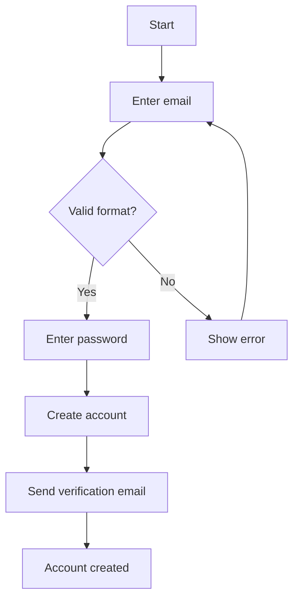
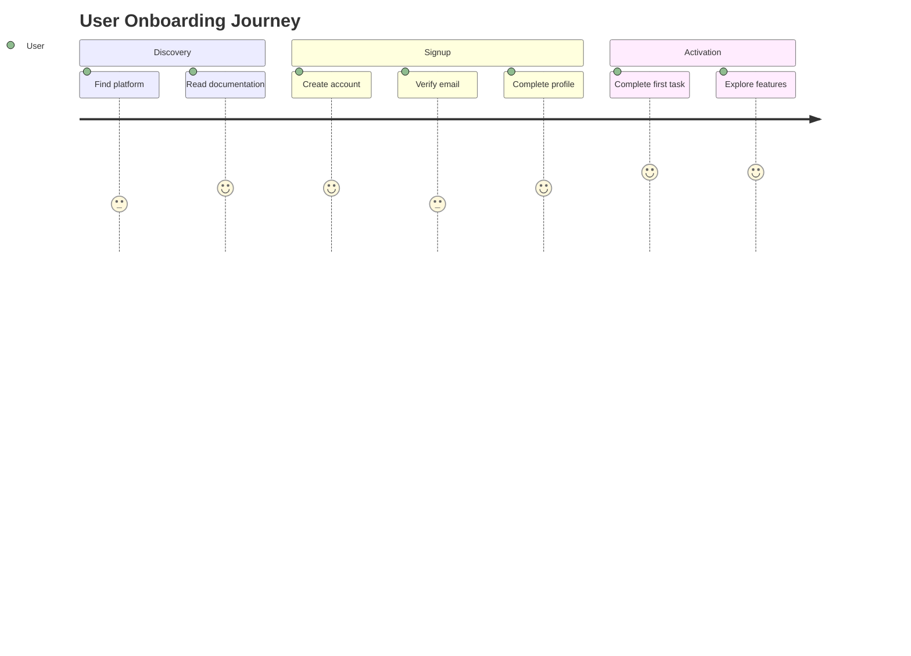
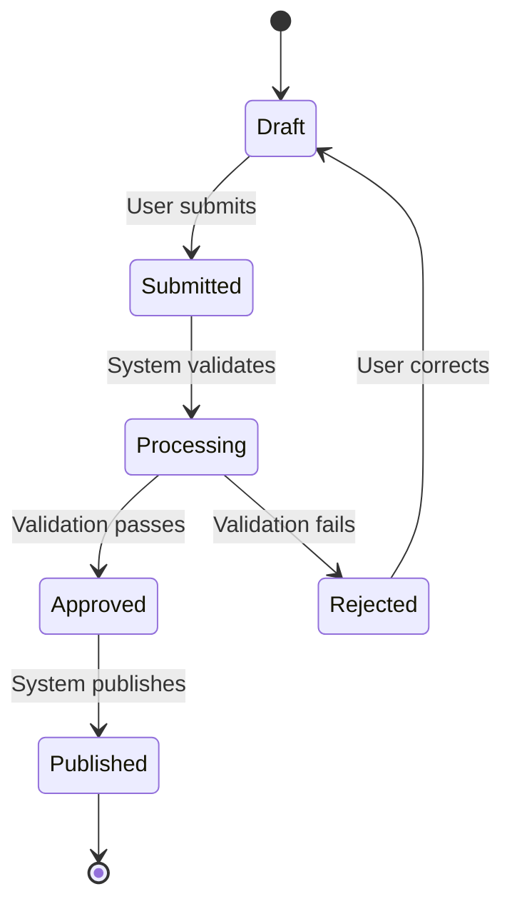
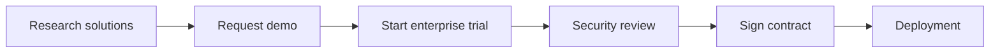
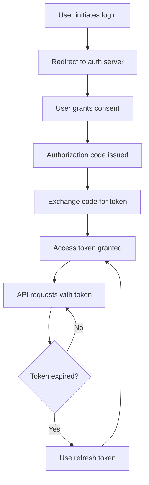

# Documentation Standards for Claude AI Agents

**Status**: Strong preference with justified deviations allowed
**Scope**: Writing documentation optimised for Claude and AI consumption
**Last Updated**: 2025-10-31

---

## Purpose

This document defines best practices for creating documentation that Claude AI agents can effectively parse, understand, and apply. This complements `documentation_standards.md` (general standards) and `documentation_for_employees.md` (human-readable standards).

---

## Core Principles

### 1. Structure Over Narrative

Claude processes structured information more efficiently than narrative prose.

**Prefer**:
```markdown
## Customer Segments

### Segment 1: Enterprise Clients
- **Size**: 35% of customers
- **Needs**: Scalability, reliability, support
- **Pain Points**: Integration complexity, vendor lock-in
```

**Over**:
```markdown
## Customer Segments

Our primary customer segment consists of enterprise clients who
require robust solutions. These customers, who represent about
35% of our base, primarily need...
```

### 2. Explicit Over Implicit

Make relationships, definitions, and context explicit rather than assumed.

**Prefer**:
```markdown
## API Rate Limiting

**Definition**: Maximum number of API requests allowed per time period
**Limit**: 1000 requests per hour per API key
**Reset Interval**: Top of each hour (UTC)
**Exceeding Limit**: 429 status code, retry after 1 hour
**Monitoring**: Available in dashboard metrics
```

**Over**:
```markdown
## API Rate Limiting

There are limits on how many API requests you can make. If you
exceed the limit, your requests will be rejected until the next hour.
```

### 3. Consistent Formatting

Use consistent patterns throughout documentation for predictable parsing.

**Metadata Block** (top of file):
```markdown
**Status**: [Reference/Guide/Overview]
**Scope**: [What this covers]
**Last Updated**: [YYYY-MM-DD]
```

**Section Headers**: Use hierarchical structure
```markdown
# Main Topic
## Subtopic
### Specific Item
```

**Lists**: Use consistent markers
- Unordered: `-` (dash)
- Ordered: `1.` `2.` `3.` (numbers with periods)
- Nested: Indent with 2 spaces

### 4. Machine-Readable Data

Present quantitative data in structured formats.

**Prefer**:
```markdown
## Key Metrics

| Metric | Definition | Target | Current |
|--------|-----------|--------|---------|
| Response Time | Milliseconds from request to response | < 200ms | 145ms |
| Conversion Rate | Signups to active users | > 75% | 82% |
```

**Or**:
```markdown
## Key Metrics

**Response Time**:
- Definition: Milliseconds from request to response
- Target: < 200ms
- Current: 145ms

**Conversion Rate**:
- Definition: Signups to active users
- Target: > 75%
- Current: 82%
```

---

## Document Structure

### Standard Template

```markdown
# [Document Title]

**Status**: [Reference/Guide/Overview/Specification]
**Scope**: [One sentence describing coverage]
**Last Updated**: [YYYY-MM-DD]

---

## Overview

[2-3 sentences summarising purpose and content]

---

## [Main Section 1]

### [Subsection 1.1]

[Content in structured format]

### [Subsection 1.2]

[Content in structured format]

---

## [Main Section 2]

[Content]

---

## Related References

- [Link to related doc](path/to/doc.md)
- [External resource](https://example.com)

---

**Maintained By**: [Name/Team]
**For**: [Primary audience]
```

### Essential Sections

**Every document should include**:
1. Title (H1)
2. Metadata block (Status, Scope, Last Updated)
3. Overview section
4. Logical content sections
5. Related References
6. Footer metadata (Maintained By, For)

---

## Content Patterns

### Definitions

Use explicit definition format:

```markdown
**[Term]**: [Clear, concise definition]

**Example**: [Optional concrete example]

**Aliases**: [Alternative terms]
```

Example:
```markdown
**Webhook**: HTTP callback mechanism that delivers real-time information to other applications when specific events occur.

**Example**: When a payment is processed, a webhook sends payment confirmation data to the accounting system.

**Aliases**: HTTP callback, web callback, event notification
```

### Processes

Use numbered steps or flowcharts:

```markdown
## User Onboarding Process

1. **Account Creation**
   - Input: Email and password
   - Action: Validate email format and password strength
   - Output: Provisional user account

2. **Email Verification**
   - Input: Verification token from email
   - Action: Confirm email ownership
   - Output: Verified user account

3. **Profile Setup**
   - Input: User profile details
   - Action: Validate and store information
   - Output: Complete user profile
```

Or use Mermaid diagrams:

```markdown
## User Onboarding Process


```

### Requirements

Use clear requirement markers:

```markdown
## API Integration Requirements

**Production Environment**:
- ✅ **Required**: Valid API key
- ✅ **Required**: HTTPS/TLS 1.2 or higher
- ✅ **Required**: Webhook endpoint for async responses
- ✅ **Required**: Request rate limit compliance (< 1000/hour)
- ⚠️ **Optional**: Custom retry logic
- ❌ **Prohibited**: Unencrypted transmission of sensitive data
```

### Comparisons

Use tables for clear comparison:

```markdown
## Deployment Options Comparison

| Aspect | Cloud Hosting | On-Premise | Hybrid |
|--------|--------------|------------|--------|
| Setup Time | < 1 hour | 2-3 days | 1-2 days |
| Initial Cost | $0 | $50,000 | $25,000 |
| Monthly Cost | $500/month | $2,000/month | $1,200/month |
| Scalability | Automatic | Manual | Semi-automatic |
| Maintenance | Provider | In-house | Split |
| Control Level | Limited | Full | Moderate |
```

### Metrics

Provide structured metric definitions:

```markdown
## Metric: User Activation Rate

**Definition**: Percentage of registered users who complete first meaningful action within 7 days

**Formula**: `(Users with First Action / Total Registered Users) × 100`

**Data Source**: `analytics.user_events` table

**Frequency**: Calculated daily, reported weekly

**Target**: > 75%

**Current Performance**: 82% (as of 2025-10-21)

**Segmentation**:
- By acquisition channel
- By user type (free vs paid)
- By geographic region

**Related Metrics**:
- Time to first action
- 30-day retention rate
- Feature adoption rate
```

---

## Language Considerations

### Consistent Language

Follow your organisation's language standards (British or American English).

**Date Format**: YYYY-MM-DD (ISO 8601) for machine readability
- Example: 2025-10-21

**Time Format**: 24-hour clock with timezone
- Example: 14:30 UTC, 09:00 PST

### Terminology Consistency

**Always use consistent terms**:
- Reference terminology documentation for domain-specific terms
- Use exact spelling and capitalisation
- Define abbreviations on first use

Example:
```markdown
**SLA (Service Level Agreement)**: [Definition]

From this point, use "SLA" consistently.
```

---

## Cross-Referencing

### Internal References

Use relative paths:

```markdown
## Related Information

See [customer_segments.md](customer_segments.md) for segment definitions.

See [regulatory_compliance.md](regulatory_compliance.md) for filing deadlines.
```

### External References

Provide full context:

```markdown
## External Resources

**API Documentation**:
- [REST API Reference](https://api.example.com/docs)
- Complete REST API endpoint documentation

**RFC 7231 (HTTP Semantics)**:
- [Section 6.5.1 - 404 Not Found](https://tools.ietf.org/html/rfc7231#section-6.5.1)
- HTTP status code specification for missing resources
```

---

## Diagrams and Visualisations

### Mermaid Diagrams

**When to use**:
- Processes with decision points (flowchart)
- Customer journeys (journey or flowchart)
- State machines (stateDiagram)
- Timelines (gantt)
- Relationships (graph or erDiagram)

**Guidelines**:
- Keep diagrams focused (max 15-20 nodes)
- Use clear, descriptive labels
- Include title for context
- Test rendering in target environment

**Example - User Journey**:


**Example - State Diagram**:


### Tables

Use tables for structured data:

```markdown
| Column 1 | Column 2 | Column 3 |
|----------|----------|----------|
| Value 1  | Value 2  | Value 3  |
| Value 4  | Value 5  | Value 6  |
```

**Alignment**:
- Left align: `|:---------|`
- Centre align: `|:--------:|`
- Right align: `|---------:|`

---

## Metadata and Tagging

### Status Tags

Use consistent status indicators:

- `Reference` - Factual reference material
- `Guide` - How-to documentation
- `Overview` - High-level summary
- `Specification` - Technical specification
- `Decision` - Decision record or rationale

### Scope Definition

Clearly define what the document covers:

```markdown
**Scope**: API authentication process from request to token validation
```

```markdown
**Scope**: User segments for SaaS platform (Enterprise and SMB)
```

### Version Information

Include last updated date:

```markdown
**Last Updated**: 2025-10-31
```

For significant changes, consider changelog section:

```markdown
## Change Log

| Date | Change | Author |
|------|--------|--------|
| 2025-10-21 | Added Australia segment data | Mitchell Murphy |
| 2025-09-15 | Initial creation | Mitchell Murphy |
```

---

## Examples

### Example 1: Business Concept Documentation

```markdown
# User Segments

**Status**: Reference
**Scope**: SaaS platform user segments (Enterprise and SMB)
**Last Updated**: 2025-10-31

---

## Overview

This document defines the primary user segments for the platform, including demographic profiles, needs, pain points, and value propositions.

---

## Segment Definitions

### Segment 1: Enterprise Teams

**Size**: 35% of customer base

**Demographics**:
- Company size: 500+ employees
- Location: Global, primarily North America and Europe
- Background: Established corporations with dedicated IT teams

**Needs**:
- Scalability for large user bases
- Enterprise-grade security and compliance
- Custom integrations with existing systems
- Dedicated support and SLAs

**Pain Points**:
- Integration complexity
- Vendor lock-in concerns
- Compliance requirements (SOC 2, GDPR)
- Cost predictability at scale

**Value Proposition**:
- Enterprise SSO and access controls
- Dedicated account management
- 99.99% uptime SLA
- Custom API integrations

**Typical Journey**:


---

## Related References

- [authentication_methods.md](authentication_methods.md) - SSO integration details
- [key_metrics.md](key_metrics.md) - Segment-specific metrics

---

**Maintained By**: Product Team
**For**: Claude AI agents and product team
```

### Example 2: Process Documentation

```markdown
# API Authentication Process

**Status**: Guide
**Scope**: OAuth 2.0 authentication flow for API access
**Last Updated**: 2025-10-31

---

## Overview

This guide documents the API authentication process, requirements, token management, and security considerations.

---

## Definition

**OAuth 2.0 Authentication**: Industry-standard protocol for authorization allowing secure API access without exposing user credentials.

**Grant Type**: Authorization Code with PKCE (Proof Key for Code Exchange)

**Also Known As**: OAuth2, OAuth 2.0 Authorization Framework

---

## Requirements

### Authentication Flow

**Token Expiry**:
- Access token: 1 hour from issuance
- Refresh token: 30 days from issuance

**Renewal Window**: Request new access token before expiry using refresh token

**Example**:
- Token issued: 2025-10-21 14:00:00 UTC
- Access token expires: 2025-10-21 15:00:00 UTC
- Refresh before: 2025-10-21 14:55:00 UTC (recommended)

### Required Parameters

✅ **Must provide**:
- Client ID (issued during app registration)
- Client Secret (stored securely, never exposed)
- Redirect URI (must match registered URI)
- Scope (requested permissions)

❌ **Not required**:
- User password (handled by authorization server)

---

## Process Flow



---

## Security Requirements

**For Production Applications**:
1. Use HTTPS for all authentication requests
2. Store client secret securely (environment variables, secrets manager)
3. Validate redirect URIs to prevent open redirects
4. Implement token refresh before expiry

**Token Storage**:
- Access token: Secure, httpOnly cookie or memory
- Refresh token: Encrypted secure storage
- Never expose in URLs or logs

---

## Error Handling

**Invalid Token**:
- Status code: 401 Unauthorized
- Action: Attempt refresh, fallback to re-authentication
- User impact: Redirected to login

**Expired Refresh Token**:
- Status code: 401 Unauthorized
- Action: Full re-authentication required
- User impact: Must log in again

---

## Related References

- [api_security.md](api_security.md) - Complete security guidelines
- [error_codes.md](error_codes.md) - All API error responses

---

**Maintained By**: Platform Team
**For**: Claude AI agents and engineering team
```

---

## Anti-Patterns

### Avoid Ambiguity

**Avoid**:
```markdown
API requests usually complete pretty quickly if the server isn't busy.
```

**Prefer**:
```markdown
**API Response Time**: 145ms average (target: < 200ms)
- 90% complete in < 200ms
- 98% complete in < 500ms
- Delays possible for: complex queries, rate limiting, network issues
```

### Avoid Narrative Fluff

**Avoid**:
```markdown
Our users really love how fast and intuitive our platform is.
They appreciate the seamless experience and excellent support.
```

**Prefer**:
```markdown
**User Satisfaction**:
- NPS: +65
- Platform usability rating: 4.7/5
- Primary drivers: Speed, intuitive UI, responsive support
```

### Avoid Implicit Context

**Avoid**:
```markdown
Tokens need to be refreshed regularly.
```

**Prefer**:
```markdown
**Token Refresh Requirement**:
- **What**: OAuth access token renewal
- **When**: Before 1-hour expiry, recommended at 55 minutes
- **How**: Use refresh token via /oauth/token endpoint
- **Who**: Client application automatically
- **Consequence**: 401 Unauthorized if expired token used
```

---

## Testing Documentation

### Validation Checklist

Before finalising documentation for Claude:

- [ ] Metadata block present (Status, Scope, Last Updated)
- [ ] Overview section provides clear summary
- [ ] Structure is hierarchical and consistent
- [ ] Data is explicitly defined, not implied
- [ ] Cross-references use relative paths
- [ ] Consistent language (British or American English per org standard)
- [ ] Mermaid diagrams render correctly
- [ ] Tables format correctly
- [ ] No ambiguous terms without definition
- [ ] Related references section present

### Claude Comprehension Test

Ask Claude to:
1. Summarise the document
2. Answer specific questions from the content
3. Apply information to a scenario
4. Identify any ambiguities or gaps

---

## Related Standards

**General Documentation**: `documentation_standards.md`
**Employee Documentation**: `documentation_for_employees.md`
**Python Style**: `python_style.md` (for docstrings)
**Git Workflow**: `git_workflow.md` (for commit messages)

---

**Last Updated**: 2025-10-31
**Maintained By**: Mitchell Murphy
**Status**: Strong preference with justified deviations allowed
