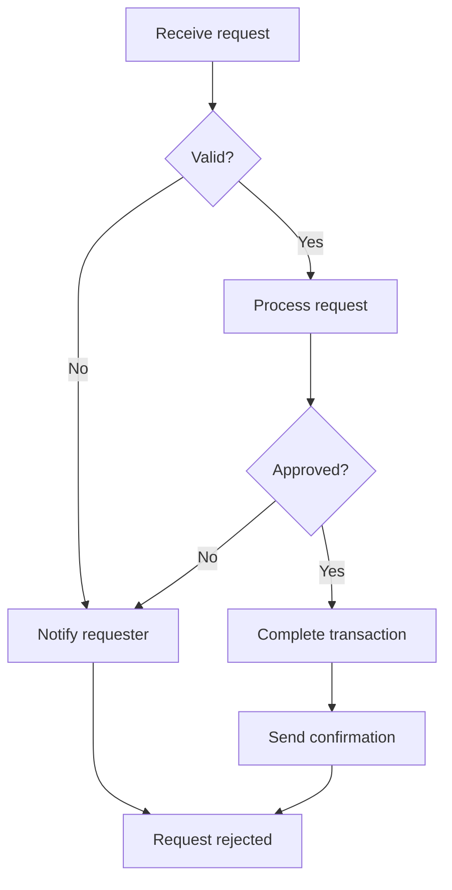
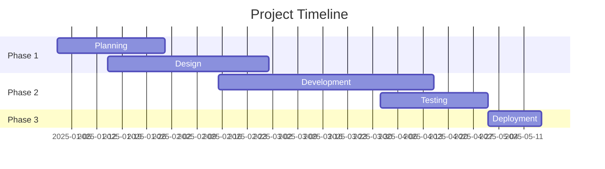

# Documentation Standards for Employee-Facing Content

**Status**: Strong preference with justified deviations allowed
**Scope**: Writing documentation optimised for human reading
**Last Updated**: 2025-10-21

---

## Purpose

This document defines best practices for creating documentation that employees can easily read, understand, and apply. This complements `documentation_standards.md` (general standards) and `documentation_for_claude.md` (AI-readable standards).

---

## Core Principles

### 1. Narrative Over Structure

Humans engage better with narrative flow and storytelling.

**Prefer**:
```markdown
## Getting Started

When you first encounter this system, you'll need to understand how the
different components work together. Let's start with the most common workflow
that you'll use day-to-day...
```

**Over**:
```markdown
## System Components

**Component 1**: Description
- Input: X
- Output: Y

**Component 2**: Description
- Input: A
- Output: B
```

### 2. Accessible Language

Use clear, jargon-free language. Explain technical terms when first introduced.

**Prefer**:
```markdown
The system uses **webhooks** to notify other applications when events occur.
Think of webhooks as automatic phone calls – when something important happens,
the system immediately calls other services to let them know.
```

**Over**:
```markdown
Event-driven architecture implemented via webhook endpoints per RFC specification.
```

### 3. Practical Examples

Use real-world examples that employees encounter.

**Prefer**:
```markdown
### Example: Processing a Customer Order

When a customer places an order, here's what happens:

1. Order details are validated
2. Inventory is checked
3. Payment is processed
4. Confirmation email is sent

Let's walk through each step with a specific example...
```

### 4. Visual Learning

Include diagrams, examples, and visual aids to support understanding.

---

## Document Structure

### Standard Template

```markdown
# [Page Title]

> [One-sentence summary or key takeaway]

## Introduction

[Narrative introduction that sets context and explains why this matters]

## [Section 1: Main Content]

[Narrative explanation with examples]

### [Subsection if needed]

[Supporting detail]

## [Section 2: More Content]

[Continue narrative]

## Quick Reference

[Bullet points of key takeaways]

## Common Questions

**[Question 1]**
[Clear answer]

**[Question 2]**
[Clear answer]

## Related Pages

- [Link to related content](Related-Page.md)

---

*Last updated: [Date] | Maintained by [Name/Team]*
```

### Essential Sections

**Most documents should include**:
1. Title with clear purpose
2. Brief summary or key takeaway
3. Introduction explaining context
4. Main content in logical sections
5. Quick reference or key points
6. Common questions (if applicable)
7. Related pages
8. Footer with metadata

---

## Tone and Voice

### Conversational but Professional

**Prefer**:
```markdown
You might be wondering why we need this extra validation step. The reason
is that it prevents errors downstream and saves time in the long run.
```

**Avoid**:
```markdown
Validation is mandatory per specification requirements.
```

### Empathetic and Supportive

**Prefer**:
```markdown
We know this process can feel complex at first. Don't worry – after you've
done it a few times, it becomes second nature. This guide will walk you
through each step.
```

**Avoid**:
```markdown
Follow the process. It's straightforward.
```

### Clear about Who Does What

**Prefer**:
```markdown
### Your Responsibilities
- Review the data for accuracy
- Approve or reject submissions
- Document any issues

### System Responsibilities
- Validate data format
- Send notifications
- Generate reports
```

---

## Language Guidelines

### Clarity and Simplicity

**Short sentences**: Aim for < 25 words per sentence

**Short paragraphs**: 3-5 sentences maximum

**Active voice**: "The system processes requests" not "Requests are processed by the system"

**Consistent terminology**: Use the same term throughout document

### British vs American English

**Be consistent within your organisation**. If your organisation uses British English:

**British spelling**:
- organisation (not organization)
- optimise (not optimize)
- analyse (not analyze)
- centre (not center)
- colour (not color)

**If using American English**, use American spelling consistently.

### Terminology

**Define abbreviations on first use**:

```markdown
The system uses **API (Application Programming Interface)** endpoints to
communicate with external services. From this point, we'll refer to these
as APIs.
```

**Link to glossary for complex terms**:

```markdown
For more information on technical terms used in this guide, see our
[glossary](Glossary.md).
```

---

## Content Patterns

### Explaining Processes

Use narrative flow with numbered steps:

```markdown
## How to Submit a Request

Here's how the submission process works:

1. **Gather your information**

   Before you start, make sure you have all the required details. You'll need:
   - Customer ID
   - Request type
   - Supporting documentation

2. **Fill in the form**

   Navigate to the Requests section and click "New Request". The form will
   guide you through each required field.

3. **Review and validate**

   Before submitting, double-check that all information is correct. The system
   will highlight any missing or invalid fields.

4. **Submit and track**

   Click Submit to send your request. You'll receive a confirmation email and
   can track progress in the dashboard.

**What if my submission fails?**

If you encounter an error, check the error message for specific guidance.
Most common issues are due to missing required fields or invalid data formats.
```

### Explaining Requirements

Make requirements clear without being intimidating:

```markdown
## What You Need to Get Started

Here's everything you'll need:

**Access Credentials** ✓
- Your employee ID
- System password (set during onboarding)
- Two-factor authentication app

**Required Information** ✓
- Customer details
- Request type
- Supporting documentation

**Optional but Helpful** ◯
- Previous request reference (if related)
- Additional context or notes

That's it! Most submissions take less than 5 minutes.
```

### Comparing Options

Use tables for clarity:

```markdown
## Processing Options Compared

We offer three processing speeds to suit different needs:

| Feature | Standard | Priority | Express |
|---------|----------|----------|---------|
| Processing time | 5 business days | 2 business days | Same day |
| Cost | Free | £25 | £75 |
| Support level | Email | Email + Phone | Dedicated contact |
| Use when | No time pressure | Moderately urgent | Critical deadline |

**Which option is right for you?**

- **Standard**: Most requests (95% of submissions)
- **Priority**: Important but not critical deadlines
- **Express**: Time-critical or high-value requests

Still not sure? Contact the support team for guidance.
```

### Timelines and Deadlines

Make time-sensitive information crystal clear:

```markdown
## Important Deadlines

### Monthly Tasks

**By the 5th of each month**:
- Review previous month's reports
- Verify data accuracy
- Submit corrections if needed

**By the 15th of each month**:
- Complete monthly submissions
- Update customer records

### Quarterly Tasks

**Last day of quarter** (Mar 31, Jun 30, Sep 30, Dec 31):
- Quarterly reconciliation
- Submit summary reports

### Ad-Hoc Tasks

**Within 24 hours** of notification:
- Respond to urgent customer requests
- Acknowledge system alerts

**Within 3 business days** of receipt:
- Process standard requests
- Complete assigned reviews
```

---

## Visual Elements

### When to Use Diagrams

Use diagrams to illustrate:
- Workflows and processes
- System architecture
- Decision trees
- Timelines

**Example - Process Flow**:


**Example - Timeline**:


### Callout Boxes

Use formatting for important information:

```markdown
> **💡 Top Tip**
>
> You can save time by creating templates for frequently-used requests.
> This ensures consistency and reduces data entry errors.

> **⚠️ Important**
>
> Always verify customer information before submitting. Corrections
> require additional processing time and may delay completion.

> **ℹ️ Did You Know?**
>
> The system automatically validates data formats and will alert you
> to common errors before submission.
```

### Screenshots and Examples

When helpful, include:
- Screenshots of the interface
- Example forms filled in
- Sample outputs

*Note: Keep screenshots up to date when interfaces change.*

---

## Common Questions Section

Include a section addressing frequent questions:

```markdown
## Common Questions

**What happens if I submit incorrect information?**

You can edit submissions within 1 hour of submitting. After that, contact
support to request corrections. It's always better to double-check before
submitting to avoid delays.

**How long does processing take?**

Standard requests are processed within 5 business days. You'll receive
status updates via email and can check progress in the dashboard at any time.

**Who should I contact if I have problems?**

For technical issues, contact IT support at support@example.com. For process
questions, reach out to your team lead or check this documentation first.

**Can I submit bulk requests?**

Yes! If you have more than 10 requests, use the bulk upload feature. Download
the template, fill it in, and upload the CSV file. The system will validate
all entries before processing.
```

---

## Examples

### Example 1: Getting Started Guide

```markdown
# Getting Started with the Request System

> Everything you need to know to submit and track requests

## Welcome

This guide will help you get up and running with the request system.
Whether you're submitting your first request or need a refresher, this
guide covers everything you need to know.

## What is the Request System?

The request system is our centralised platform for managing customer requests,
internal approvals, and workflow automation. It replaces the previous
email-based process and provides better tracking and visibility.

## Why We Use It

You might be wondering why we moved to this system. Here are the key benefits:

**Better Tracking**
- See exactly where each request stands
- Get automatic status updates
- Never lose track of pending items

**Faster Processing**
- Automated validation catches errors early
- Smart routing sends requests to the right people
- Parallel processing reduces wait times

**Improved Visibility**
- Managers can see team workload
- Generate reports instantly
- Identify bottlenecks quickly

**Audit Trail**
- Complete history of all actions
- Who did what and when
- Supports compliance requirements

## Getting Access

### First Time Setup

1. **Receive your invitation**

   Your manager will send you an invitation email with a link to set up
   your account.

2. **Create your password**

   Click the link and create a secure password. We recommend using a
   password manager.

3. **Set up two-factor authentication**

   Download an authenticator app (Google Authenticator or Authy) and
   scan the QR code to enable 2FA.

4. **Complete your profile**

   Add your contact details and notification preferences.

That's it! You're ready to start using the system.

### Logging In

Visit [system.example.com](https://system.example.com) and enter:
- Your email address
- Your password
- Your 2FA code from your authenticator app

**Forgot your password?** Click "Reset Password" and follow the email
instructions.

## Your First Request

Let's walk through submitting your first request:

### Step 1: Navigate to Requests

After logging in, click "Requests" in the left menu, then "New Request".

### Step 2: Choose Request Type

Select the type of request you're submitting. The most common types are:
- Customer onboarding
- Account modification
- Service cancellation
- Exception approval

Not sure which type? Hover over each option for a description.

### Step 3: Fill in Details

The form will adapt based on your selected request type. Required fields
are marked with a red asterisk (*).

**Top tips**:
- Fill in all fields completely
- Use the format helpers (date pickers, dropdowns)
- Add notes if anything needs explanation

### Step 4: Attach Documentation

If you have supporting documents, click "Attach Files" and upload them.
Accepted formats: PDF, PNG, JPG, DOC, XLS (max 10MB per file).

### Step 5: Review and Submit

Before submitting, review the summary page. Check that:
- All information is correct
- Required documents are attached
- The request type is appropriate

Click "Submit Request" to send it for processing.

### Step 6: Track Progress

After submitting, you'll receive:
- Immediate on-screen confirmation
- Email confirmation within 2 minutes
- Status updates as the request progresses

You can check status anytime in the "My Requests" section.

## Understanding Status Codes

As your request moves through the system, its status will update:

**Submitted** - Request received, awaiting initial validation
**In Review** - Being reviewed by the processing team
**Pending Approval** - Waiting for manager approval
**Processing** - Actively being worked on
**Completed** - Request successfully completed
**Rejected** - Request could not be completed (see notes for reason)

## What Happens Next

After submitting your request:

**Within 1 hour**:
- Automated validation runs
- You'll be notified of any errors

**Within 1 business day**:
- Request assigned to processor
- Initial review completed

**Within 5 business days**:
- Request processed and completed
- Confirmation sent

**Need it faster?** Select "Priority" or "Express" processing when submitting.

## Getting Help

**Technical Issues**
- Email: support@example.com
- Phone: ext. 1234
- Hours: Mon-Fri 9AM-5PM

**Process Questions**
- Check this documentation first
- Ask your team lead
- Join the weekly Q&A sessions (Fridays 2PM)

**Training**
- Monthly training sessions (first Wednesday)
- Video tutorials in the Help section
- One-on-one sessions available by request

## Related Pages

- [Request Types Explained](Request-Types.md)
- [Advanced Features](Advanced-Features.md)
- [Troubleshooting Common Issues](Troubleshooting.md)
- [FAQs](FAQs.md)

---

*Last updated: 21/10/2025 | Maintained by Operations Team*
```

---

## Testing Documentation

### Readability Checklist

Before publishing employee-facing documentation:

- [ ] Written in clear, jargon-free language
- [ ] Technical terms explained on first use
- [ ] Includes practical examples
- [ ] Narrative flows logically
- [ ] Headings are descriptive
- [ ] Sentences are concise (< 25 words)
- [ ] Paragraphs are short (3-5 sentences)
- [ ] Consistent spelling/terminology
- [ ] Common questions addressed
- [ ] Related pages linked

### Readability Tests

**Flesch Reading Ease**: Aim for 60+ (standard)
**Flesch-Kincaid Grade Level**: Aim for 8th-10th grade

Online tools can test these metrics automatically.

### User Testing

If possible, ask someone unfamiliar with the topic to:
1. Read the document
2. Explain it back to you
3. Identify anything confusing
4. Confirm they could apply the information

---

## Related Standards

**General Documentation**: `documentation_standards.md`
**Claude Documentation**: `documentation_for_claude.md`
**Git Workflow**: `git_workflow.md`

---

**Last Updated**: 2025-10-21
**Maintained By**: Mitchell Murphy
**Status**: Strong preference with justified deviations allowed
