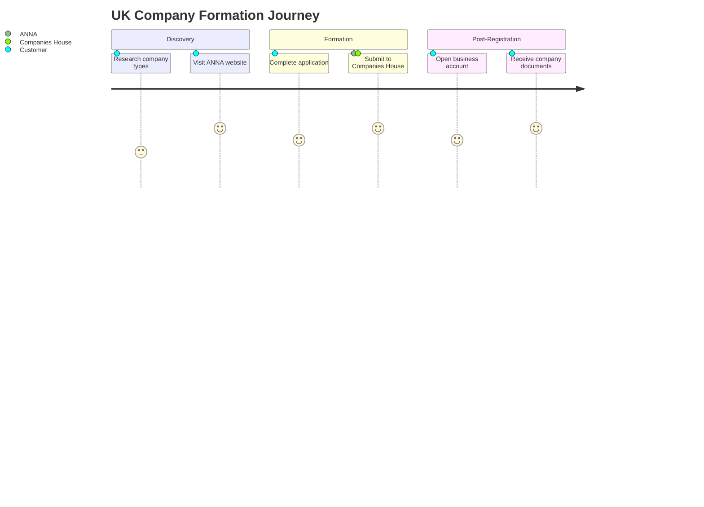
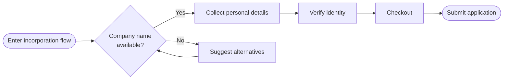

# User Journey Diagram Standards

**Status**: Technical Standard
**Scope**: Workspace-wide guidance for user journey and flow diagrams
**Last Updated**: 2025-10-31

---

## Overview

This document defines standards and best practices for creating user journey diagrams, user flow diagrams, and customer journey maps across all projects. These visualisations help teams understand customer experiences, identify pain points, and optimise user interactions.

---

## When to Create User Journey Diagrams

### Use Cases

**User Journey Diagrams** are appropriate for:
- Mapping end-to-end customer experiences
- Identifying touchpoints and interactions
- Understanding emotional states throughout a journey
- Documenting pain points and opportunities
- Onboarding and feature adoption flows
- Multi-step processes with decision points

**Do NOT use** for:
- System architecture diagrams (use architecture diagrams instead)
- Database schemas (use ERD diagrams instead)
- Code flow logic (use sequence diagrams instead)
- Simple linear processes with <3 steps (describe in prose instead)

---

## UX Design Best Practices

### 1. Start with User Goals and Research

**Foundation**:
- Identify what users aim to achieve
- Create separate journey maps for each persona (different needs, different journeys)
- Base diagrams on actual user research, not assumptions
- Document data sources (user interviews, analytics, feedback)

**Example**:
> "UK sole trader incorporating first business" vs "Serial entrepreneur registering holding company" will have different journeys, pain points, and expectations.

### 2. Focus on User Perspective

**Principles**:
- Journey maps are roadmaps for understanding how users interact with products
- Step into users' shoes and see experience from their perspective
- Document what users see, feel, and do (not internal system processes)
- Include emotional states and sentiment at each stage

**What to capture**:
- User actions (what they do)
- User thoughts (what they think)
- User emotions (how they feel)
- Pain points (where they struggle)
- Delighters (where they're pleasantly surprised)

### 3. Break Down Journey into Phases

**Structure**:
- Divide journey into logical stages or phases
- Each phase should represent a distinct goal or context
- Typical phases: Discovery → Consideration → Decision → Action → Post-Action
- For product flows: Entry → Setup → Core Task → Completion → Follow-up

**Benefits**:
- Visualises touchpoints and interactions clearly
- Helps identify where improvements are needed
- Makes complex journeys digestible
- Enables phased optimisation efforts

### 4. Simplify Pathways

**Guidelines**:
- Streamline user paths to reduce complexity
- Remove unnecessary steps that don't add value
- Balance simplicity with completeness (too simple can be cryptic)
- Show happy path prominently, edge cases as branches
- Use progressive disclosure (show details on demand)

**Warning**: A flow that looks elegant on paper but hides complexity can be unusable for actual users.

### 5. Visual Design Clarity

**Standards**:
- Use consistent symbols and colours across diagrams
- Provide legend explaining visual elements
- Use clear, concise labels (action verbs for actions, nouns for states)
- Maintain visual hierarchy (primary path vs alternatives)
- Ensure diagrams are readable at standard zoom levels

**Colour conventions**:
- Blue: Standard steps/states
- Green: Success states or completed actions
- Yellow/Amber: Decisions or conditional branches
- Red: Errors, blockers, or incomplete/unknown steps
- Grey: Optional or alternative paths

### 6. Align with Business Objectives

**Strategic considerations**:
- Understand business goals and feature objectives
- Identify which journey parts align with business KPIs
- Use pain points and emotional states to prioritise optimisation
- Document opportunities for business value creation
- Link journey stages to metrics and conversion funnels

### 7. Incorporate Feedback and Iterate

**Continuous improvement**:
- Use insights from user testing and prototypes to refine diagrams
- Update diagrams when design or user needs change
- Validate assumptions with real user data
- Share with stakeholders and gather feedback
- Version control changes and document rationale

### 8. Include Entry and Exit Points

**Critical elements**:
- Mark where users enter the journey (sources, referrals, direct)
- Identify potential drop-off points (where users abandon)
- Document exit states (success, failure, abandonment)
- Measure conversion at each transition
- Understand user intent at entry points

### 9. Validate with Real Data

**Data-driven approach**:
- Experience the journey firsthand (walk through as user)
- Conduct usability tests with real users
- Analyse quantitative data (analytics, conversion rates)
- Gather qualitative feedback (interviews, surveys)
- Share diagrams with cross-functional stakeholders for validation

---

## Diagram Types and When to Use Them

### User Journey Map

**Purpose**: Show emotional experience and touchpoints across end-to-end journey

**When to use**:
- Understanding holistic customer experience
- Identifying pain points and emotional states
- Communicating customer perspective to stakeholders
- Strategic planning and opportunity identification

**Format**: Typically horizontal timeline with phases, showing actions, thoughts, emotions, and touchpoints

**Tools**: Mermaid journey diagram, or custom visualisation

**Example use case**: "UK Company Formation Customer Journey" showing Discovery → Formation → Post-Registration phases with sentiment scoring

### User Flow Diagram

**Purpose**: Show specific paths users take to complete tasks

**When to use**:
- Designing interaction flows for features
- Documenting step-by-step processes
- Showing decision points and conditional logic
- Technical documentation of user interactions

**Format**: Flowchart with nodes (screens/actions) and edges (transitions)

**Tools**: Mermaid flowchart, D3.js flowchart, dagre layout

**Example use case**: "Incorporation Application Flow" showing each screen, decision, and possible path through the application

### Service Blueprint

**Purpose**: Show both user-facing and behind-the-scenes processes

**When to use**:
- Documenting complex service delivery
- Aligning front-stage and back-stage operations
- Understanding system dependencies
- Process optimisation across teams

**Format**: Layered diagram showing user actions, frontstage interactions, backstage processes, and support systems

**Tools**: Custom diagrams, Mermaid flowchart with swimlanes

**Example use case**: "Company Formation Service Blueprint" showing customer actions, ANNA team actions, Companies House processes, and supporting systems

---

## Implementation Patterns

### Static Diagrams (Mermaid)

**When to use**:
- Documentation in markdown files
- Simple journeys with <20 steps
- Version-controlled diagrams
- GitHub wiki or README visualisations

**Advantages**:
- Text-based, easy to update
- Version controlled (git diff shows changes)
- Renders in GitHub, GitLab, Obsidian, etc.
- No build process required
- Accessible (screen readers can parse markdown)

**Limitations**:
- Limited interactivity (no click, hover, filter)
- Size constraints (complex diagrams become unreadable)
- Layout control is automatic (less customisation)

**Best practices**:
- Use subgraphs for logical grouping
- Keep diagrams focused (split complex journeys into multiple diagrams)
- Add notes for additional context
- Test rendering in target platform
- Use appropriate diagram type (flowchart, journey, sequence, etc.)

**Example**: See `formations-wiki/docs/customer-journeys/README.md` for Mermaid journey examples

### Interactive Diagrams (D3.js)

**When to use**:
- Complex journeys with many steps or branches
- Need for expand/collapse functionality
- Filtering or highlighting subsets of journey
- Detailed tooltips or contextual information
- Exploring large datasets or multiple scenarios

**Advantages**:
- Full interactivity (click, hover, zoom, pan, filter)
- Handle complex visualisations (100+ nodes)
- Custom styling and animations
- Rich tooltips and contextual information
- Progressive disclosure (show details on demand)

**Limitations**:
- Requires HTML file (not pure markdown)
- More complex to maintain
- Needs testing in browsers
- Accessibility requires extra work

**Best practices**:
- Separate data from visualisation code
- Store journey data in JSON for easy updates
- Create self-contained HTML files (no external dependencies except CDN)
- Provide legend and instructions
- Include fallback for non-interactive viewing
- Test across browsers (Chrome, Firefox, Safari)
- Consider mobile/tablet viewports

**Data structure pattern**:
```json
{
  "name": "Journey Root",
  "type": "root",
  "children": [
    {
      "name": "Phase 1: Discovery",
      "type": "section",
      "children": [
        {
          "name": "View homepage",
          "type": "view",
          "notes": "Entry point from organic search or referral"
        },
        {
          "name": "Click 'Register company'",
          "type": "action",
          "notes": "Primary CTA in hero section"
        }
      ]
    }
  ]
}
```

**Recommended libraries**:
- **D3.js v7+**: Core visualisation library
- **Dagre**: Layout algorithm for flowcharts
- **D3-hierarchy**: Tree layouts for hierarchical data

### Hybrid Approach (Recommended)

**Best of both worlds**:
- Create static Mermaid diagram for documentation
- Create interactive D3.js version for exploration
- Link from markdown to HTML file
- Maintain single source of truth for content

**When to use**:
- Complex journeys that benefit from interactivity
- Documentation needs to be accessible in markdown
- Users need both overview and detailed exploration

**Implementation**:
1. Define journey data in JSON file
2. Create markdown documentation with static Mermaid overview
3. Create interactive HTML with full journey details
4. Link from markdown to HTML: "View interactive diagram"

**Example structure**:
```
docs/customer-journeys/
├── incorporation_journey.md          # Markdown documentation
├── data/
│   └── incorporation_flow.json       # Source of truth
└── interactive/
    └── incorporation_flow.html       # Interactive D3.js diagram
```

---

## D3.js Implementation Patterns

### Collapsible Tree Layout (Horizontal)

**Use case**: Sequential flows with grouped sections that can be expanded/collapsed

**Pattern**:
```javascript
// CRITICAL: When using .nodeSize(), MUST initialize root position
// Create hierarchy
const root = d3.hierarchy(data);

// REQUIRED: Initialize root coordinates before first render
// Prevents all nodes overlapping at (0,0)
root.x0 = height / 2;  // Center vertically for horizontal layout
root.y0 = 0;            // Start at left edge

console.log('Root initialized at:', root.x0, root.y0);  // Verification

// Horizontal layout: swap x and y in projection
const tree = d3.tree()
  .nodeSize([dy, dx]);

const diagonal = d3.linkHorizontal()
  .x(d => d.y)
  .y(d => d.x);

// Click handler for collapse/expand
function click(event, d) {
  if (d.children) {
    d._children = d.children;
    d.children = null;
  } else {
    d.children = d._children;
    d._children = null;
  }
  update(event, d);
}
```

**CRITICAL REQUIREMENT**: Root position initialization

When using `tree.nodeSize()`:
- **MUST** set `root.x0` and `root.y0` before calling `update()`
- Without initialization, all nodes start at (0,0) causing overlap
- For horizontal layout: `root.x0 = height/2, root.y0 = 0`
- For vertical layout: `root.x0 = 0, root.y0 = width/2`

**Why required**:
- `.nodeSize()` positions root at (0,0) in layout coordinate space
- Nodes animate from `source.x0, source.y0` to calculated positions
- Without x0/y0, defaults to (0,0) and all nodes cluster at origin
- With x0/y0, nodes spread out from root position smoothly

**Verification**:
```javascript
// After initialization, before update()
console.log('Root:', root.x0, root.y0);  // Should be non-zero
// After update(), check node positions
console.log('Nodes:', root.descendants().slice(0,3).map(d => ({
  name: d.data.name, x: d.x, y: d.y
})));  // Should have different x,y values
```

**Initial state**: Collapse nodes selectively based on depth or criteria

**Common pitfall**: Forgetting to initialize root.x0/y0 results in all nodes overlapping in top-left corner

### Dagre Flowchart Layout

**Use case**: Complex flowcharts with many decision points and loops

**Pattern**:
```javascript
// Configure dagre layout
const g = new dagre.graphlib.Graph();
g.setGraph({ rankdir: 'LR' }); // Left-to-right

// Add nodes and edges
nodes.forEach(node => {
  g.setNode(node.id, { label: node.name, width: 100, height: 40 });
});

edges.forEach(edge => {
  g.setEdge(edge.source, edge.target);
});

// Compute layout
dagre.layout(g);

// Render with D3.js
```

**Advantages**: Handles complex graphs with cycles, multiple parents, and crossing edges

### Filtering Pattern

**Use case**: Toggle visibility of node types (views, actions, decisions)

**Pattern**:
```javascript
// Filter buttons
const filters = { views: true, actions: true, decisions: true };

function toggleFilter(type) {
  filters[type] = !filters[type];
  updateVisibility();
}

function updateVisibility() {
  svg.selectAll('.node')
    .style('opacity', d => filters[d.type] ? 1 : 0.2)
    .style('pointer-events', d => filters[d.type] ? 'all' : 'none');
}
```

### Tooltip Pattern

**Use case**: Show contextual information on hover

**Pattern**:
```javascript
// Tooltip div
const tooltip = d3.select('body').append('div')
  .attr('class', 'tooltip')
  .style('opacity', 0);

// Hover handlers
node.on('mouseover', function(event, d) {
  tooltip.transition().duration(200).style('opacity', 1);
  tooltip.html(d.notes || d.name)
    .style('left', (event.pageX + 10) + 'px')
    .style('top', (event.pageY - 10) + 'px');
})
.on('mouseout', function() {
  tooltip.transition().duration(200).style('opacity', 0);
});
```

---

## Content and Terminology Standards

### British English

All user journey diagrams must use British English spelling and terminology:

**Spelling**:
- Optimise (not optimize)
- Customise (not customize)
- Analyse (not analyze)
- Behaviour (not behavior)
- Centre (not center)

**Terms**:
- Whilst (not while in formal writing)
- Towards (not toward)
- Amongst (not among in formal writing)

### Naming Conventions

**Node labels**:
- Use action verbs for actions: "Click submit", "Enter email"
- Use "View" prefix for screen views: "View registration page"
- Use questions for decisions: "Account verified?"
- Be concise (max 5-6 words)

**Phase/section names**:
- Use nouns or noun phrases: "Discovery", "Personal Details"
- Group logically related steps
- Order chronologically

**File naming**:
- Markdown: `snake_case.md` (e.g., `incorporation_user_flow.md`)
- Data: `snake_case.json` (e.g., `incorporation_flow.json`)
- Interactive: `snake_case.html` (e.g., `incorporation_flow.html`)

### Documentation Structure

Every user journey diagram should include:

1. **Overview section**: Purpose, scope, customer segments
2. **Diagram/visualisation**: Static or interactive
3. **Journey stages breakdown**: Description of each phase
4. **Touchpoints**: Where users interact with product/service
5. **Known gaps**: What's incomplete or requires research
6. **Related references**: Links to personas, metrics, domain docs

**Template** (markdown):
```markdown
# [Journey Name]

**Status**: Reference
**Scope**: [Customer segments or features]
**Last Updated**: [Date]

---

## Overview

[Brief description of journey and its purpose]

---

## Journey Diagram

[Mermaid diagram or link to interactive HTML]

---

## Journey Stages

### Stage 1: [Name]

**Description**: [What happens in this stage]

**Touchpoints**:
- [Interaction 1]
- [Interaction 2]

**Customer Sentiment**: [Positive/Neutral/Negative and why]

**Pain Points**:
- [Pain point 1]

**Opportunities**:
- [Opportunity 1]

---

## Known Gaps

[What's incomplete or requires further research]

---

## Related References

- [Link to related docs]

---

**Maintained By**: [Name]
**For**: [Audience]
```

---

## CORS Prevention for Interactive Diagrams

### Understanding the Problem

**CORS (Cross-Origin Resource Sharing)** is a browser security policy that prevents web pages from making requests to different origins. When creating interactive D3.js visualizations as standalone HTML files, CORS issues commonly occur.

**The Scenario**:
1. Create HTML file with D3.js visualization
2. Use `d3.json('data.json')` to load external data
3. Open HTML file directly in browser (`file:///path/to/file.html`)
4. Browser blocks the JSON request due to CORS policy
5. Visualization fails to render (often silently)

**Why It Happens**:
- Chrome (and other browsers) treat `file://` protocol as `null` origin
- Requests from `file://` to another `file://` are considered cross-origin
- Browser blocks these requests for security reasons
- `d3.json()`, `fetch()`, `XMLHttpRequest` all trigger CORS checks

**Symptoms**:
- Blank visualization with no visible error
- Console error: "Access to XMLHttpRequest at 'file://...' blocked by CORS policy"
- Network tab shows failed request with status "(failed)"
- Works in Firefox but fails in Chrome (browsers have different CORS policies)

### Solution 1: Embed Data in HTML (Recommended)

**When to use**:
- Creating self-contained HTML files for documentation
- Small to medium datasets (<100KB)
- Files intended to be opened directly (no server)
- Maximum portability and ease of use

**Implementation**:
```html
<script>
    /*
     * DATA EMBEDDED TO AVOID CORS ISSUES
     *
     * Source of truth: ../data/journey_data.json
     *
     * To update:
     * 1. Edit ../data/journey_data.json
     * 2. Copy entire JSON content
     * 3. Paste below, replacing journeyData object
     * 4. Save and refresh browser
     */
    const journeyData = {
        // Entire JSON content pasted here
        "name": "Customer Journey",
        "children": [...]
    };

    // Use data directly (no async loading needed)
    try {
        if (!journeyData || !journeyData.name) {
            throw new Error('Invalid data structure');
        }
        initializeVisualization(journeyData);
    } catch (error) {
        console.error('Failed to initialize:', error);
        displayErrorMessage(error);
    }
</script>
```

**Advantages**:
- ✅ Works in all browsers with `file://` protocol
- ✅ No server required - truly portable
- ✅ No CORS errors possible
- ✅ Single file contains everything
- ✅ No async loading complexity

**Disadvantages**:
- Slightly larger HTML file size
- Must manually sync when data changes
- Less separation of concerns

**Best Practice**:
- Keep external JSON file as "source of truth"
- Document sync process clearly in HTML comments
- Include clear update instructions
- Consider this the default approach for documentation projects

### Solution 2: Local Development Server

**When to use**:
- Large datasets (>100KB)
- Active development with frequent data changes
- Multiple visualizations sharing data
- Testing production deployment scenarios

**Setup Options**:

**Python** (built-in):
```bash
cd project-directory
python3 -m http.server 8000
# Open http://localhost:8000/visualization.html
```

**Node.js**:
```bash
npm install -g http-server
cd project-directory
http-server -p 8000
```

**VS Code Live Server** (recommended for development):
1. Install "Live Server" extension
2. Right-click HTML file
3. Select "Open with Live Server"
4. Auto-refreshes on file changes

**Advantages**:
- ✅ Mirrors production environment
- ✅ Easy data updates (just edit JSON)
- ✅ No file size penalty
- ✅ Proper separation of concerns

**Disadvantages**:
- Requires server setup
- Not portable (viewers must run server)
- Extra setup step

**When to choose**: Use during development, but embed data for final deliverable if creating documentation visualizations.

### Recommendation

**For documentation projects** (like user journey diagrams):
- **Use embedded data** (Solution 1)
- Maximizes portability and ease of use
- Works for stakeholders who just want to double-click and view

**For web applications**:
- Use external data loading with proper server setup
- Implement proper error handling for production

---

## Error Handling Requirements

### Mandatory Error Handling for D3.js Visualizations

**All interactive visualizations MUST include comprehensive error handling**. Silent failures (blank diagrams with no indication of what went wrong) are unacceptable.

### Required Components

**1. Try-Catch Wrapper**:
```javascript
try {
    initializeVisualization(data);
} catch (error) {
    console.error('Visualization error:', error);
    displayErrorMessage(error);
}
```

**2. Data Validation**:
```javascript
function validateData(data) {
    if (!data) {
        throw new Error('Data is null or undefined');
    }
    if (!data.name || !data.children) {
        throw new Error('Data missing required properties (name, children)');
    }
    if (!Array.isArray(data.children)) {
        throw new Error('children must be an array');
    }
    return true;
}
```

**3. User-Friendly Error Display**:
```javascript
function displayErrorMessage(error) {
    const container = document.getElementById('diagram');
    container.innerHTML = `
        <div class="error-message">
            <h3>Unable to Load Diagram</h3>
            <p>There was an error initializing the visualization.</p>
            <p><strong>Error:</strong> <code>${error.message || 'Unknown error'}</code></p>
            <p>Please check the browser console for more details.</p>
        </div>
    `;
}
```

**4. Console Logging**:
```javascript
console.error('Diagram initialization failed:', {
    error: error.message,
    stack: error.stack,
    data: data,
    timestamp: new Date().toISOString()
});
```

**5. Loading States**:
```html
<!-- Initial state -->
<div id="diagram">
    <div class="loading">
        <div class="spinner"></div>
        <p>Loading diagram...</p>
    </div>
</div>
```

```javascript
// Clear loading state on success
function initializeVisualization(data) {
    document.getElementById('diagram').innerHTML = '';
    // ... render visualization
}
```

### Error Handling Checklist

- [ ] Try-catch around initialization code
- [ ] Data structure validation before rendering
- [ ] User-friendly error message displayed
- [ ] Error logged to console for debugging
- [ ] Loading state shown during initialization
- [ ] Loading state cleared on success or error
- [ ] Graceful degradation (page doesn't crash)

---

## Testing Interactive Visualizations

### Pre-Deployment Testing Checklist

**Critical**: Test in strictest environment first (Chrome with `file://` protocol)

**Browser Testing**:
- [ ] Chrome - open file directly (file:// protocol)
  - Check console for errors (F12 → Console)
  - Check Network tab for failed requests
  - Verify no CORS errors
- [ ] Firefox - open file directly
  - Verify all features work
  - Check for browser-specific issues
- [ ] Safari - open file directly
  - Test on macOS if applicable
  - Verify touch interactions (if applicable)

**Functional Testing**:
- [ ] Visualization renders correctly
- [ ] All interactive features work (click, hover, expand/collapse)
- [ ] Tooltips appear and display correct information
- [ ] Filters/controls function as expected
- [ ] Keyboard navigation works (if applicable)

**Error State Testing**:
- [ ] Intentionally break data (corrupt JSON)
  - Verify error message appears
  - Verify console shows helpful error
  - Verify page doesn't crash
- [ ] Test with empty data
- [ ] Test with malformed data

**Responsive Testing**:
- [ ] Desktop viewport (1920x1080, 1440x900)
- [ ] Tablet viewport (768x1024)
- [ ] Mobile viewport (375x667)
- [ ] No horizontal scroll (unless intended)

**Performance Testing**:
- [ ] Test with maximum expected data size
- [ ] Check initial load time (<3 seconds)
- [ ] Test with network throttling (Slow 3G)
- [ ] Verify no browser hang or freeze

**Code Quality**:
- [ ] No console errors in any browser
- [ ] JSON data validates (use `jq` or online validator)
- [ ] HTML validates (W3C validator)
- [ ] All resources load successfully (CDNs, etc.)

### What This Testing Would Have Caught

The original CORS bug would have been immediately obvious:
1. ✅ Opening in Chrome → blank diagram
2. ✅ Console check → CORS error visible
3. ✅ Network tab → failed JSON request
4. ✅ Testing in Firefox → works (inconsistency indicates CORS issue)
5. ✅ Missing error handler → silent failure obvious to tester

**Comprehensive testing standards**: See [interactive_visualization_testing.md](interactive_visualization_testing.md) for detailed testing requirements.

---

## Best Practices for Self-Contained HTML Files

### Creating Portable Visualizations

**Goal**: Create HTML files that work reliably when opened directly in any browser.

**Implementation Pattern**:

1. **Embed all data** directly in HTML
2. **Use CDN for libraries** (D3.js, etc.) - acceptable external dependency
3. **Include comprehensive error handling**
4. **Provide clear update instructions** in HTML comments
5. **Document browser compatibility** in comments
6. **Test in strictest environment** (Chrome file://) before sharing

### Update Workflow for Embedded Data

**Maintain two files**:
1. **External JSON** - source of truth, easy to edit
2. **HTML with embedded JSON** - production file, ready to view

**Update process**:
1. Edit external JSON file
2. Copy entire JSON content
3. Paste into HTML file's data constant
4. Save HTML file
5. Test in browser

**Document clearly**:
```html
<!--
  DATA SOURCE: ../data/user_journey.json

  TO UPDATE THIS DIAGRAM:
  1. Edit ../data/user_journey.json with your changes
  2. Copy the entire JSON content from that file
  3. Paste below, replacing the journeyData object (lines 50-200)
  4. Save this HTML file
  5. Refresh in browser to verify changes
-->
```

---

## Maintenance and Updates

### Updating Journey Diagrams

**When content changes**:
1. **For Mermaid diagrams**: Edit markdown directly, commit changes
2. **For D3.js diagrams**: Update JSON data file, verify rendering, commit changes
3. Update "Last Updated" date in documentation
4. Document rationale in commit message

**Commit message format**:
```
docs(customer-journeys): update incorporation flow with identity verification steps

Added new Sumsub document verification step and selfie verification.
Updated pain points based on recent user testing feedback.
```

### Version Control Best Practices

**What to commit**:
- ✅ Markdown documentation
- ✅ JSON data files
- ✅ HTML interactive diagrams
- ✅ Supporting images or assets
- ❌ Generated files (if diagrams auto-generate from data)

**Review checklist before committing**:
- [ ] British English spelling throughout
- [ ] Consistent terminology with other docs
- [ ] All links functional (internal and external)
- [ ] Diagrams render correctly (test in GitHub preview)
- [ ] Interactive features work in browsers (if applicable)
- [ ] "Last Updated" date current
- [ ] Cross-references valid

### Validation and Testing

**For static Mermaid diagrams**:
- Preview in GitHub markdown preview
- Test in Mermaid Live Editor
- Verify rendering in wiki platform (if applicable)
- Check accessibility (alt text, semantic structure)

**For interactive D3.js diagrams**:
- Test in Chrome, Firefox, Safari (latest versions)
- Verify all interactive features work:
  - Expand/collapse
  - Filtering
  - Tooltips
  - Zoom/pan (if applicable)
- Test on different screen sizes (desktop, tablet, mobile)
- Check performance with large datasets (if applicable)
- Verify accessibility (keyboard navigation, ARIA labels)

**User validation**:
- Walk through journey yourself as user
- Conduct usability tests with representative users
- Share with stakeholders for feedback
- Validate against analytics data
- Compare with customer feedback and support tickets

---

## Related Standards

**Documentation Standards**:
- [documentation_for_claude.md](documentation_for_claude.md)
- [documentation_for_employees.md](documentation_for_employees.md)
- [documentation_standards.md](documentation_standards.md)

**Git Workflow**:
- [git_workflow.md](git_workflow.md)

**Project-Specific Context**:
- `formations-wiki/.claude/project_context.md`

---

## Examples and Templates

### Example: Simple Mermaid Journey Map



### Example: Mermaid Flowchart



### Example: D3.js Data Structure

See implementation in `formations-wiki/docs/customer-journeys/data/incorporation_flow.json`

---

## Resources

**D3.js**:
- [D3.js Official Documentation](https://d3js.org/)
- [Observable HQ - D3 Examples](https://observablehq.com/@d3)
- [D3 Graph Gallery](https://d3-graph-gallery.com/)

**Dagre Layout**:
- [Dagre GitHub](https://github.com/dagrejs/dagre)
- [Dagre Wiki](https://github.com/dagrejs/dagre/wiki)

**Mermaid**:
- [Mermaid Documentation](https://mermaid.js.org/)
- [Mermaid Live Editor](https://mermaid.live/)

**UX Journey Mapping**:
- [Nielsen Norman Group - Journey Mapping](https://www.nngroup.com/articles/customer-journey-mapping/)
- [Interaction Design Foundation - User Flows](https://www.interaction-design.org/literature/topics/user-flows)

---

**Last Updated**: 2025-10-31
**Maintained By**: Mitchell Murphy
**Status**: Active
